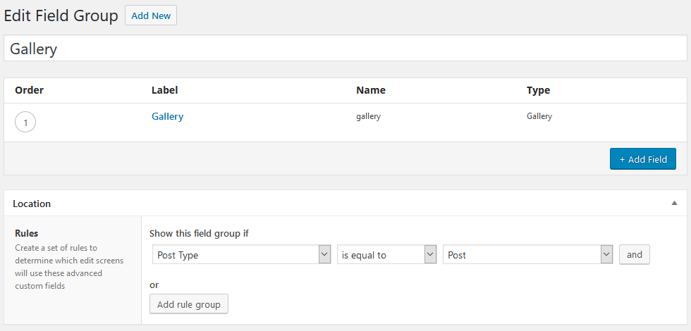

# Create a lightbox gallery with ACF and baguetteBox.js

_This recipe shows how to easily create a lightbox gallery in WordPress with [ACF Pro](https://www.advancedcustomfields.com/pro/) and [baguetteBox.js](https://github.com/feimosi/baguetteBox.js/)_

Create a new field group with a gallery field and show this group on posts, pages or other post types:



Create `[your-theme]/templates/components/gallery.twig` template to display gallery images:

```twig


  <h3>Gallery</h3>
  <div class="c-gallery js-gallery">
    
      
      <a href="{{image.src('large')}}" data-caption="{{image.alt}}" class="c-gallery__item">
        
      </a>
    
  </div>

```

Include it in `[your-theme]/templates/single.twig` on the place where you want to display the gallery:

```twig

```

Add custom styling for gallery thumnails to `src/styles/components/_gallery.scss`, for example:

```css
.c-gallery {
  display: flex;
  flex-wrap: wrap;
}

.c-gallery__item {
  display: block;
  margin: 0 1em 1em 0;
  width: 150px;
  transition: opacity 200ms ease-in-out;

  &:hover {
    opacity: 0.7;
  }
}

.c-gallery__image {
  display: block;
}
```

Now, install `baguetteBox.js`

```bash
npm install baguettebox.js --save
```

or 

```bash
yarn add baguettebox.js
```

Create `src/scripts/modules/lightbox.js`:

```js
import baguettebox from 'baguettebox.js';

class Lightbox {
  constructor() {
    this.init();
  }

  init() {
    baguettebox.run('.js-gallery');
  }
}

export default Lightbox;
```

and import it in `src/scripts/app.js`:

```js
import Lightbox from './modules/lightbox';

new Lightbox();
```

Finally, import required baguetteBox CSS - create `src/styles/vendor/_lightbox.scss` with:

```css
@import 'baguettebox.js/src/baguettebox.scss';
```

and add the `vendor` folder to `src/styles/main.scss`:

```css
@import 'settings/*';
@import 'tools/*';
@import 'generic/*';
@import 'elements/*';
@import 'objects/*';
@import 'components/*';
@import 'utilities/*';
@import 'vendor/*';
```
