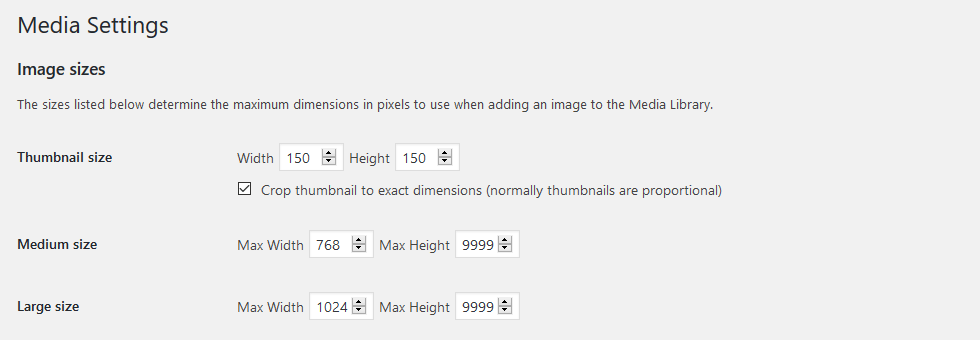

# Responsive lazy loading images

_This recipe shows how to create responsive lazy loading images in WordPress._

First, change your media settings in _Settings / Media_ to reflect commons images sizes on your website.



Next, add aditional image sizes in `[your-theme]/Chisel/Media.php` class:

```php
  /**
   * Use this method to register custom image sizes
   */
  public function addImagesSizes() {
    add_image_size( 'small', 320, 9999 );
    // add_image_size( 'hero', 1600, 9999 );
  }
```

Then use those image sizes to setup [responsive images](https://jakearchibald.com/2015/anatomy-of-responsive-images/) in your Twig templates, for example:

```twig
<div class="c-image">
  
    
  
</div>
```

Verify if the correct sizes are loaded on different breakpoints in the Network tab in your browser's dev tools.

To turn the images into lazing loading images, install [lazysizes](https://github.com/aFarkas/lazysizes) library:

```batch
npm install lazysizes --save
```

or 

```
yarn add lazysizes
```

Then import it in `src/scripts/app.js`:

```javascript
import lazySizes from 'lazysizes';

lazySizes.init();
```

Update your Twig template so it works with the lazySizes library:

```twig
<div class="c-image">
  
    
  
</div>
```

We added `class="lazyload"` and `data-` prefix to the attributes and loaded an empty image in the required `src` attribute.

If particular image aspect radio doesn't change, you can avoid content jumps by using [intrinsic placeholders](http://daverupert.com/2015/12/intrinsic-placeholders-with-picture/). Create styles for the image component in `src/styles/components/_image.scss`:

```css
.c-image {
  height: 0;
  overflow: hidden;
  padding-top: 66.6667%; // 3:2 aspect ratio
  position: relative;
  width: 100%;

  img {
    display: block;
    height: 100%;
    left: 0;
    position: absolute;
    top: 0;
    width: 100%;
  }
}
```


