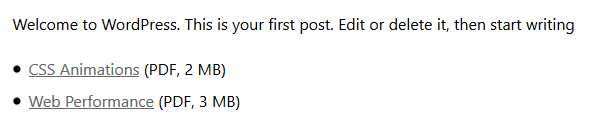

# Get human readable attachment size in WordPress 

_This recipe demonstrates how you can extend Twig with your own functions._

If you display a list of attachments in your posts or custom post types, you can display their file size and type like follows.

First update `[your-theme]/Chisel/TwigExtensions.php`, add new method to the `TwigExtensions` class

```php
public function getAttachmentMeta( $id ) {
	return wp_prepare_attachment_for_js( $id );
}
```

Register this method as a Twig function in the `registerTwigFunctions` method in the same file:

```php
$this->registerFunction(
	$twig,
	'getAttachmentMeta',
	array(
		$this,
		'getAttachmentMeta',
	)
);
```

Then you can use  `getAttachmentMeta` function in your Twig templates, eg. `[your-theme]/templates/single.twig`:

```twig

  <ul>
    
      
      <li>
        <a href="{{ attachment.link }}">{{ attachment.title }}</a>
        ({{ attachmentMeta.subtype|upper }}, {{ attachmentMeta.filesizeHumanReadable }})
      </li>
    
  </ul>

```

Attachment type and size will be displayed like this:



Check out [additional details about the attachment](https://codex.wordpress.org/Function_Reference/wp_prepare_attachment_for_js), which you can use, for example `{{ attachmentMeta.dateFormatted }}`.
